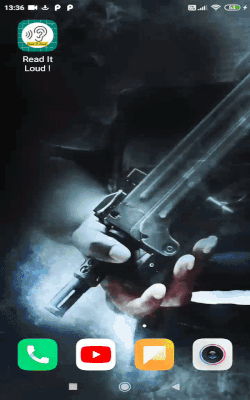

## Read-It-Loud
* An Android App that takes pdf file from the device file manager as input and translate the text from one language(here English ) to  another language(here Hindi).

<h1 align="center">:memo: Read-It-Loud ! :speaking_head::ear_with_hearing_aid:</h1>

  </img>

 

## Motivation:
 * The Android App can be used by specially abled people , they can open the  pdf and its reads out  the translated words.

## Features:

* [x] User can upload pdf file from the device file explorer.
* [x] When clicked on Translate button , the text in English is translated to Hindi.
* [x] Once translated, user can select the Read option for text-to-sppech.

## Tech Stack:

* Built with Android Studio(Java).
* iTextpdf Library for reading , uploading pdf files.
* Firebase ML Kit for language recognition and translation.
* Android TTS Library to convert text to speech according to Locale language codes.

## Demo : ( `Video in ./screenshots/output.mp4`)

## Future Scope
* [ ] Can import all the pdf files into app and translate them.
* [ ] Create registration ,session based logins for different users and maintain individial user files.
* [ ] Create an array of all languages using Firebase ML Kit and translate vice-versa.
* [ ] Implement tts for various languages.

This project was done as a part of MCAN - Mobile Cellular and Adhoc Networks miniproject ` in less than 24 hours.`

